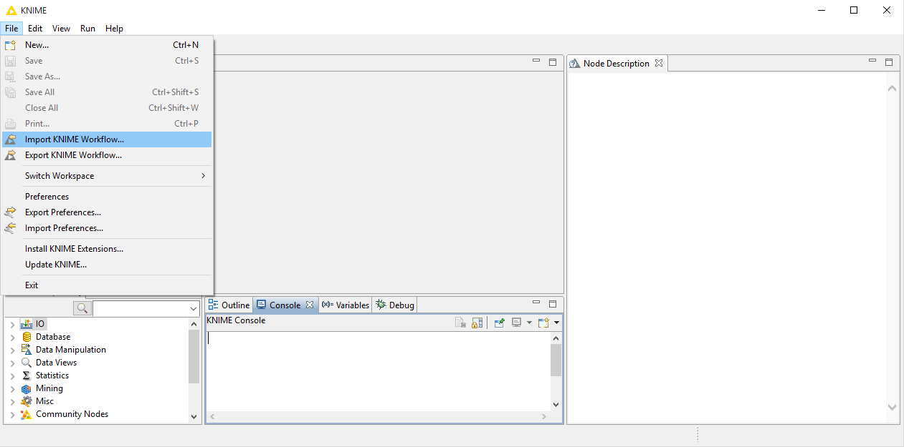
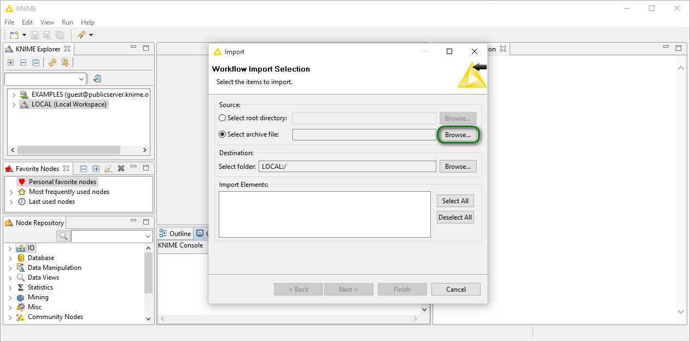
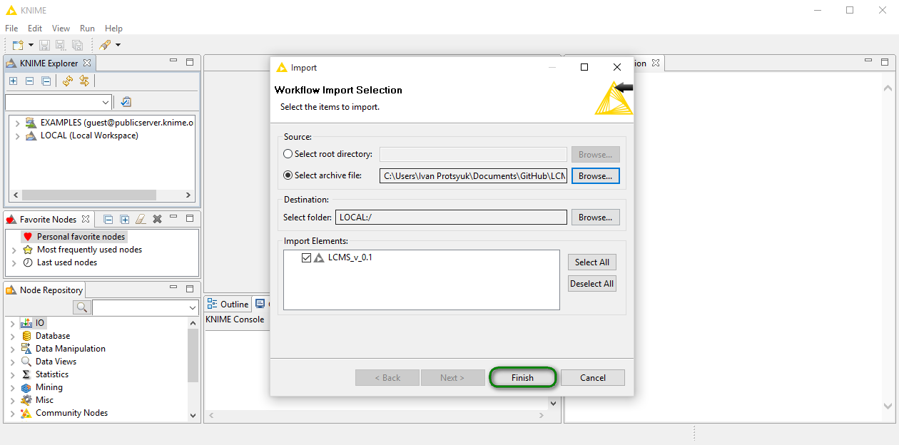
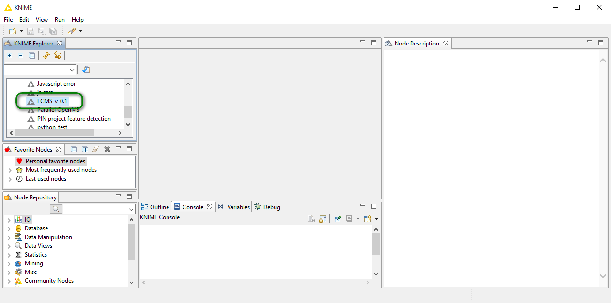
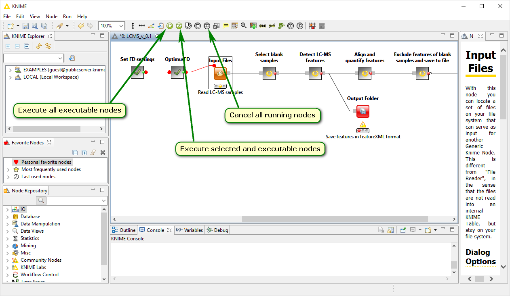
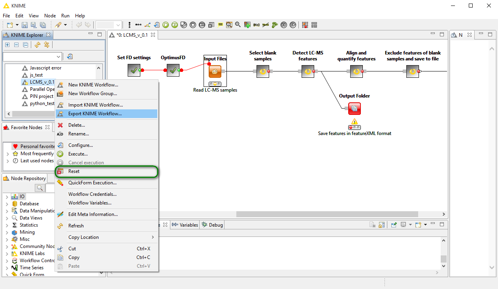
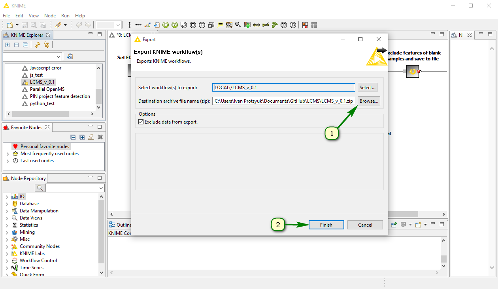

### Table of contents

* [Introduction](#introduction)
* [Basic features](#basic-features)
  * [1. Open existing workflow](#1-open-existing-workflow)
  * [2. Change workflow settings](#2-change-workflow-settings)
  * [3. Execute workflow](#3-execute-workflow)
  * [4. Save intermediate results](#4-save-intermediate-results)
  * [5. Share your workflow](#5-share-your-workflow)

## Introduction

If you've already had some experience with other workflow management systems (WMS) such as [Galaxy](galaxyproject.org) or [Taverna](www.taverna.org.uk), it'll be easier for you to get started with KNIME. One of the main advantages of using WMSs instead of regular monolothic applications/scripts is that they enable people without skills in programming to actually create programs. Such programs, or workflows, are essentially sets of different operations, or workflow nodes, that are applied consecutively to the input data. One can think about a workflow execution as a flow of the input data through different units that can modify the data or/and add some new information to it. The programming itself resembles playing with Lego bricks. In this case, bricks are different algorithms that process your data. They’re similar to bricks indeed as WMSs usually have a graphical interface where nodes are represented as rectangles of different colors and can be arranged by a user. After a workflow is built, it can be shared as a file with other people that can run it on their own datasets.

## Basic features

Below, you can find a tutorial on those KNIME features that you’ll need when using the workflow published at this repository.

### 1. Open existing workflow

In KNIME window go to `{ File => Import KNIME Workflow… }`.

Then, the `Import` dialog should show up.

Check `Select archive file` then press `Browse` and specify a path to a file with a workflow that you want to open. After this, a workflow name should appear in the `Import elements` section.

**Note**: duplicated workflow names aren’t allowed in KNIME. So, if you try to import a workflow having a name that’s already used by another workflow, you’ll have to change it. In this case, the `Next` button will be active in the `Import` dialog. Press it, and you’ll be asked to type another name for the workflow being imported.
Press `Finish` to complete the import.

Now, the workflow should appear in the `KNIME Explorer` section.

### 2. Change workflow settings

Basically, there’re no settings affecting a whole workflow. Instead, each workflow node has its own set of settings that you can see in a dialog shown upon right-click on the node `=> Configure…`.

### 3. Execute workflow

Once you set input files for your workflow, you can process them. There’re two options for this: execution of all the workflow or execution of a part of the workflow.
* To execute the workflow at once, press `Execute all executable nodes` on the main toolbar.
* To execute a part of the workflow preceding a certain node inclusively, select this node and press `Execute selected and executable nodes` on the main toolbar. Using this approach, you can execute nodes one by one. If at some moment, you decide to execute the rest of the workflow, press `Execute all executable nodes`.

There’s also a possibility of cancel a running workflow. To do this, press `Cancel all running nodes` on the main toolbar.

### 4. Save intermediate results

You can save the current state of your workflow at any time when it's not running. For example, you can change configurations of some nodes, execute several other nodes and, afterwards, save your workflow to get back to it later and continue execution. To do this, press `Save` at the top-left corner of the KNIME window when your workflow is opened.

### 5. Share your workflow

You can save your workflow to a *.zip file and send it to another person afterwards.

Select your workflow in the `KNIME Explorer` section, call a right-click menu and click `Reset`. It's needed to clear the workflow from intermediate data accumulated after previous runs. Then, call a right-click menu again and select `Export KNIME workflow…` item.

The `Export` dialog should appear after this. Specify a path to a file where your workflow will be stored and press `Finish`.

