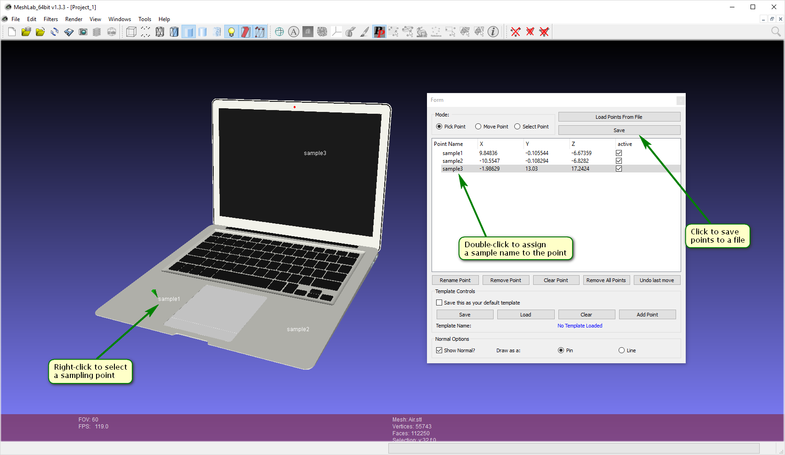

#How to obtain coordinates of sampling spots?

First of all, you need to settle upon a type of visualization you want to achieve. Namely, sampling spots can be rendered onto a picture or 3D model. Below you will find a manual for these two cases.

**A common remark:** on this page "sample name" means a file name without extension where spectral information about an LC-MS sample is stored. E.g. if you have a file with LC-MS called `PA14_EM_D-6_2738.mzML`, a corresponding sample name will be `PA14_EM_D-6_2738`.

## 2D

1. Create an empty spreadsheet in a spreadsheet software of your choice.
2. Ultimately, you will fill in the first four columns with the following information (order matters): sample name, x coordinate, y coordinate, z coordinate and sampling spot radius. So, you need to type any column names in the first row according to this structure, e.g. "sample", "x", "y", "z", "radius". Then, each sampling point will correspond to a row in this table.
3. Fill in the first column with names of your samples.
4. Fill in the fourth column with zeros. As you are going to render your sampling points onto a 2D image, the 3rd coordinate component is not used.
5. Open an image you are going to use for visualization in an image viewer application that is capable of displaying a cursor position in the coordinate system of an image. E.g. Paint suits this task on Windows.
6. For each sample, fill in the second and third columns with `x` and `y` coordinates of a sample you see in the image viewer when hovering cursor over a point where the sample is located.

7. Fill in the fifth column with approximate values of radii of sampling points. You can do it using your image viewer to estimate, for example, half of a difference between boundaries of a sampling point in a horizontal or vertical dimension.
  * No need in high precision at this stage because you will be able to change the file later after you see the first visualization.
8. Save the spreadsheet as a CSV file.

## 3D

1. Download and install Meshlab, an application for working with 3D models, from the official [downloads page](https://sourceforge.net/projects/meshlab/files/meshlab/MeshLab%20v1.3.3/).
2. Launch Meshlab, go to `File => Import mesh...` and select a file with your 3D model. 
3. After the model has shown up, call a dialog for point selection using `Edit => PickPoints`.
4. Select all sampling points on the 3D model one by one using mouse right click. Note, that, once selected, points appear in the dialog you opened at the previous step. Also, you will need to assign names to selected points that should correspond to names of your samples. To change a name of a point double-click on the corresponding item in the dialog and type a new name.

5. After all points are selected and names of your samples are assigned to them, you need to click "Save" in the dialog and select a result file.

After this, you have two options to generate a CSV table with coordinates of the sampling points.

1. KNIME workflow. It might be convenient if you already have KNIME installed.
  a. Download and open in KNIME [a workflow](./PP2CSV Conversion.zip) for conversion of files produced by Meshlab to CSV files compatible with Optimus.
  b. Select a path to an output CSV file in the configuration of `Save output file` node.
  c. In the configuration dialog of `Convert PP to CSV` node, select the file produced by Meshlab as a first parameter. You may keep the default value of the second parameter, sampling point radii. After you get the first visualization, you will be able to rerun the workflow to generate larger or smaller sampling points. Also, it is possible to change the radii manually in the result CSV file produced by the workflow.
  d. Run the workflow to generate the CSV file with coordinates of sampling spots.

2. Python script.
  a. Download [a python script](./pp2csv.py) from this repository.
  b. Run it using the following command: `python pp2csv.py <path to the *.pp file created with Meshlab> <sampling point radius>`. After you get the first visualization, you will be able to rerun the script to generate larger or smaller sampling points. Also, it is possible to change the radii manually in the result CSV file produced by the script.
  c. A file `coords.csv` will appear in your working directory.
