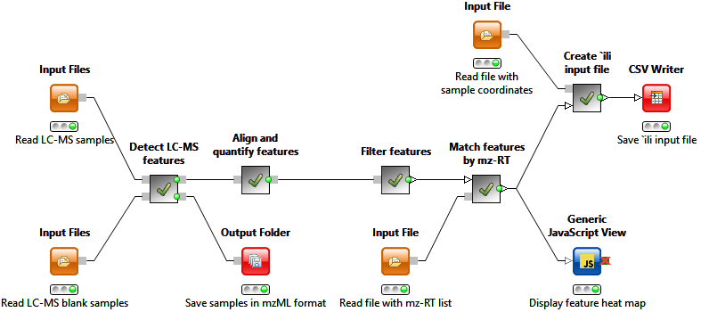
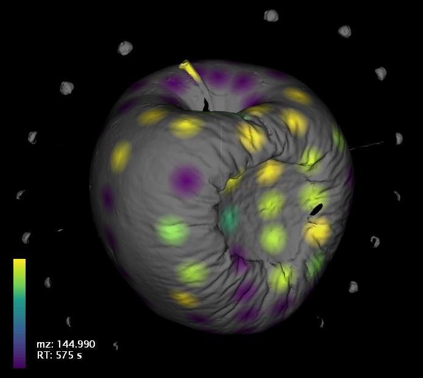

#OptimusFD: a workflow for LC-MS feature detection and quantification, coupled with `ili

###Table of contents

* [Introduction](#introduction)
* [Who might need this workflow?](#who-might-need-this-workflow)
* [What it does?](#what-it-does)
* [Installation](#installation)
* [Input](#input)
* [Basic use-case](#basic-use-case)
* [KNIME Basics](#knime-basics)
* [Demo](#demo)
* [Advanced use-cases](#advanced-use-cases)
  * [1. Setting mass deviation and noise level](#1-setting-mass-deviation-and-noise-level)
  * [2. Setting the deviation of retention time](#2-setting-the-deviation-of-retention-time)
  * [3. Exclusion of features detected in blank samples](#3-exclusion-of-features-detected-in-blank-samples)
  * [4. Exclusion of uncommon features](#4-exclusion-of-uncommon-features)
  * [5. Creating spatial maps for `ili](#5-creating-spatial-maps-for-ili)
* [Known issues](#known-issues)
* [License](#license)

## Introduction

This repository contains a complete workflow for untargeted metabolomics LC-MS data analysis from centroided data to spatial mapping of detected molecular features.

The workflow is being developed by [Alexandrov Team](http://www.embl.de/research/units/scb/alexandrov/index.html) at EMBL Heidelberg ([contact information](http://www.embl.de/research/units/scb/alexandrov/contact/index.html)).

* Developer: Ivan Protsyuk
* Principal investigator: Theodore Alexandrov

## Who might need this workflow?

The workflow can be useful if you do untargeted metabolomics with LC-MS. Especially when you have many samples, and you try to find out how similar or how different they are in regard to their chemical composition.

## What it does?

The workflow consists of the following steps:

1. Detection of LC-MS features in each input sample.
2. Alignment and quantification of all detected features among all the samples.
3. (*Optional*) Exclusion of features that came from blank samples.
4. (*Optional*) Exclusion of rare features, i.e. features that occur in a small number of samples.
5. Creating spatial maps of detected features, i.e. associating intensities of detected features with spatial coordinates of samples.

The purpose of the last step is to create a file that can be used along with a 2D/3D model for visualization in [`ili](https://chrome.google.com/webstore/detail/%60ili/nhannoeblkmkmljpddfhcfpjlnanfmkc). This is a Google Chrome application for visualization of molecular features spatially distributed. It is also being developed by Alexandrov Team.

## Installation

The workflow is performed by [KNIME Analytics Platform](https://www.knime.org/), an open-source cross-platform general-purpose workflow management system. Before you can start using the workflow, you should install **KNIME** itself, **Python 2.7** (if it's not already installed) and a few additional modules for Python and KNIME. The installation steps are described below.

1. Download and install **Python 2.7** if you don't have installed (can be the case on Windows). You can download it from [the official Python Downloads Page](https://www.python.org/downloads/).
  * You can check easily if the needed Python distribution is already installed by typing `python --version` in your command prompt. If the output line starts with "Python 2.7", you can consider the 1st step completed.
  * *Windows users*: Python installation directory might not be included to your `Path` environment variable. That's why you might get an error message upon executing `python` in command prompt although it's installed. To fix this, you should add <`Python_installation_directory`> to `Path` as well as <`Python_installation_directory\Scripts`>. By default, these directories are `C:\Python27` and `C:\Python27\Scripts`. You can find an instruction on changing `Path` variable [here](http://superuser.com/questions/143119/how-to-add-python-to-the-windows-path).
2. Install a couple of Python modules needed for interaction between KNIME and Python. You can do this by typing the command below in your command prompt.
 * *Windows users*: Before, you should download and install a [Microsoft C++ Complier](http://aka.ms/vcpython27). One of those Python modules depends on it.
  * `pip install pandas protobuf`
3. Download and install **KNIME Analytics Platform v.2.12.1**. Select a package according to your operating system on [the official KNIME Downloads Page](https://www.knime.org/downloads/overview?quicktabs_knimed=1&#knime2.12.1).
 * *Note*: If you already have KNIME installed, make sure that its version is 2.12.1. The workflow hasn't been tested with other versions.
4. Launch KNIME and install additional extensions.
  1. Go to `File => Install KNIME Extensions...`. `Available software` dialog should open after this.
  2. Check the following items in the list of available extensions:
    * `OpenMS`
    * `KNIME Python Integration`
    * `KNIME Nodes to create KNIME Quick Forms`
    * `KNIME Virtual Nodes`
  3. Proceed with the installation. You'll be asked to accept the terms of GPL license at the end.
  4. Restart KNIME after the installation is finished.

Note, that the procedure described above should be completed only **once**. So, if you get a new version of the workflow in the future, all you'll have to do is just to open it with KNIME. As soon as the steps above are accomplished, your environment is ready to run the workflow.

*Possible Python compatibility issues:* If you have several Python installations in your system, please make sure that KNIME detected the correct one. To do this, go to `File => Preferences`, then type "python" in the filter box. You should see two items at the left-hand side of the dialog: `KNIME > Python`. Click at `Python` and check that there're no error messages appear. If there're any, press `Browse...` and navigate to the python executable that was called when installing modules at the 3rd step. If you followed the instructions above precisely, you can get a path to the needed python executable by executing `which python` in Linux/OS X terminal or `where python` in Windows command prompt.

1. Download [a file with the workflow](./LCMS_v_0.1.zip) from this repository.
2. In the KNIME window, go to `File => Import KNIME Workflow...`. `Workflow Import Selection` dialog should open after this.
3. Check `Select archive file`, press `Browse...` and select the file downloaded on the 1st step.
4. Press `Finish`.

Now you should see the `LCMS_v_0.1` item in the list at the left-hand side of the KNIME window. If you double click it, the workflow will open in the Workflow Editor where you can change its settings and specify input/output files.

## Input

The workflow supports the following formats of mass spectrometry data: mzML, mzXML and mzData. Internally, all input files will be converted to mzML, so you can save some time on the workflow execution if your data are already in this format.
Make sure that input files contain centroided data.

## Basic use-case

1. Open the workflow in the KNIME Workflow Editor.
2. Do a right click on the `Input Files` node and select `Configure...`. A dialog for input file selection should show up.
3. Press `Clear`, then press `Add` and select files with your samples and press `OK`. 
4. Do a right click on the `Exclude features of blank samples and save to file` node and select `Configure...`. A dialog with settings should show up.
5. Type `Path to result features`. It will be used for saving quantified LC-MS features detected in all of your samples to a file in CSV format.
6. Make sure that the node is still selected in the Workflow Editor and press `Execute selected and executable nodes` on the KNIME main toolbar. The workflow should start execution after this.
7. After it's finished, you can browse through all the features by opening the result file in Excel.

## KNIME Basics

If you're new to workflow management systems or KNIME in particular, you can find an introductory tutorial on basic features of KNIME [here](./KNIME Basics.md).

## Demo

This repository contains real samples that you can test the workflow on. They're available in this [archive](./examples/3D/apple_samples.zip). Inside, you'll find a directory called `samples` that contains LC-MS samples in *.mzXML format ready to be processed with the workflow. There's also a `blanks` directory inside `samples`. Its content can be used to remove background features from your result features set. You can find the description on how to do this [below](#3-exclusion-of-features-detected-in-blank-samples).
There're also 2 files in the root folder called `coords.csv` and `Rotten_Apple_Model.stl`. You'll need to supply them at the last step of the workflow that is supposed to produce spatial maps for `ili.

If you want to quickly check, what are actually the results of the workflow, without diving into KNIME and installing everything, you can find these files in the `results` folder in the archive. It contains two files `features.csv` and `features_mapping.csv`. The first one is a spreadsheet with all the LC-MS features detected and quantified across all the samples. Features from the blank sample are removed from that set. The second file is also a spreadsheet containing a table with intensities of different features detected in different samples. This file is ready to be visualized in &#96;ili along with `Rotten_Apple_Model.stl`. You can just drag&drop both of them to the `ili window.

You can find below an example of a spatial map obtained from `ili for a feature that is localized mainly in the vicinity of rot on the apple.

## Advanced use-cases

In this section you'll find several improvements of the basic use-case described above. They are not connected with each other, and you can combine them in different ways when using the workflow.

###1. Setting mass deviation and noise level

Depending on your mass spec you should use different settings for feature detection. In particular, you can set allowed mass deviation and intensity of noise signal for your samples.

These parameters can be adjusted at any time before the workflow is launched. To do this, open the configuration dialog for the `Set FD Settings` node. The first two parameters are the needed ones. `mtd_mass_error_ppm` (mass error in ppm using during mass trace detection) should be a known value for your experiment. `common_noise_threshold_int` (intensity of noise signal) affects highly the number of result features produced by the workflow and its run-time. For qTOF mass specs, this value is usually about 1k-5k whereas it's better to keep it about 100k-1000k for Orbitrap devices due to their high sensitivity.

###2. Setting the deviation of retention time

On the quantification step, special algorithm is working on matching features detected in different samples between each other. If features match, they're reported as the same compound detected in different samples. Matching includes (but not limited to) checking mz and RT values. If you know that there's a significant retention time shift in your samples, you can set a threshold for RT shift at the quantification step of the workflow. Default value of this parameter is 30 seconds that is usually sufficient. However, it can be changed at any time before the `Align and quantify features` node is running. To do this, open the configuration dialog of the node and set a needed value for `RT deviation`.

###3. Exclusion of features detected in blank samples

If you use this option, a part of the features detected in your samples marked as blank ones will be removed from the result set.

1. Do the first 5 steps of the basic use-case.
2. Select the `Select blank samples` node and press `Execute selected and executable nodes`. Hold on several seconds until you see a green tick on the node.
3. Call configuration dialog on the node. It should contain a checklist of all the input files that you provided to the workflow.
4. Check all the blank samples in the list and press `OK`.
5. Open the configuration dialog for the `Exclude features of blank samples and save to file` node. There's a parameter called `Minimum intensity ratio for blank features`. It means the following: a feature detected in a blank sample will be included to the result set only if there is at least one non-blank sample, where the intensity of the feature is larger than it is in the blank sample times this parameter. So, the larger value you assign to it, the fewer features from blank samples you see in your results. A default value for this parameter is 3, but you're free to change it. If you set it to zero, all the features detected in blank samples will be included to the result set.
6. Press `OK` and complete the rest of the basic use-case steps starting from the 6th.

###4. Exclusion of uncommon features

This option allows you to remove features that weren't detected in many samples. This can significantly reduce the total number of your features, even if you exclude features that occur in less than 1% of your samples.

1. Do the first 4 steps of the basic use-case. You should see a configuration dialog that contains a parameter called `Include only features with occurance rate more than`.
2. Set this parameter to a value between `0.0` and `1.0` that means the minimal occurance rate of result features in your samples.
3. Complete the rest of the basic use-case steps starting from the 5th.

###5. Creating spatial maps for `ili

This option allows you to get files with spatial distribution of detected features that can be visualized in `ili.

1. You should create a *.csv file with spatial coordinates of your samples. There're several requirements to the file formatting. You can find an example of such a file in the [demo](#demo) section.
  * The file contains 5 columns: sample name, x coordinate, y coordinate, z coordinate, spot radius.
  * The first line of the file is treated as column headers, you can come up with any names for them.
  * Values in the 1st column should contain file names corresponding to your samples without extensions, e.g. if your sample is written to a file called "PA14_EM_1-1_E-12_P1-E-12_01_1907.mzXML" a corresponding value in the first column will be "PA14_EM_1-1_E-12_P1-E-12_01_1907".
  * Coordinates and radii are floating point numbers measured relatively to your 2D/3D model that you're going to use for visualization in `ili.
  * Coordinates for 2D pictores can be obtained from any image editor that supports displaying position of the cursor.
  * Coordinates for 3D models can be measured in a 3D model viewer, for example [MeshLab](http://meshlab.sourceforge.net/).
  * For 2D pictures, the 4th column corresponding to z coordinate should contain zeros only.
2. Do the first 5 steps of the basic use-case.
2. Select the `Create input file for 'ili` node and call its configuration dialog.
3. Type a path to the file with coorinates at the `File with coordinates of samples` parameter.
4. Set a path to the result file with spatial maps at `Result file for 'ili`.
4. Press `OK`.
5. Select the `Exclude features of blank samples and save to file` node and complete the rest of the basic use-case steps starting from the 6th.

After the workflow is finished, you'll be able to visualize the file specified at the 4th step along with your 2D/3D model in `ili.

## Known issues

* Sometimes, an error message about `ConcurrentModificationException` appears in the KNIME Console and execution stops. This is caused by an internal KNIME error that occurs upon simultaneous access to a single file by several computational nodes.
  * Workaround: If it happened, press `Execute selected and executable nodes` on the KNIME main toolbar, and execution will continue from the point where error occurred.

## License

The content of this project is licensed under the Apache 2.0 licence, see LICENSE.md.
